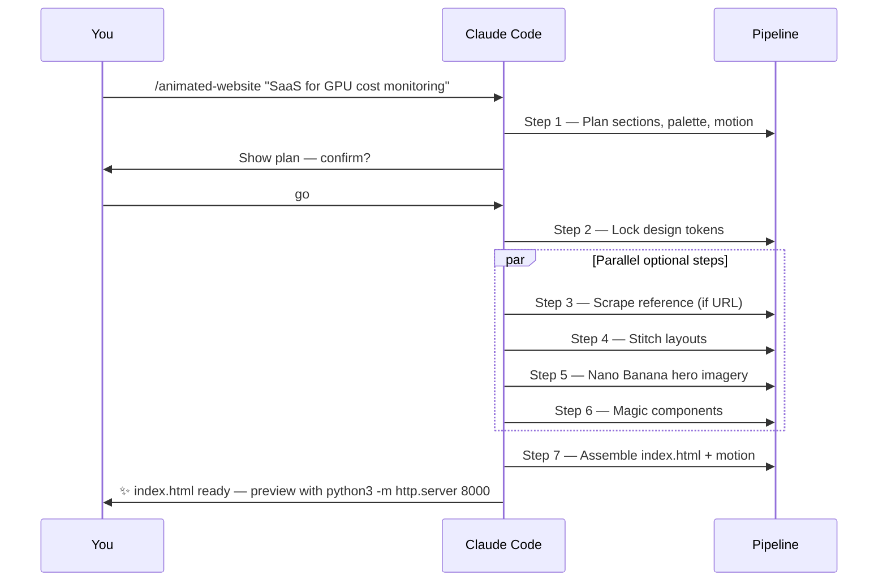

<div align="center">

# 🎨 Animated-Website-skill

### A 7-Step AI Pipeline That Turns a Text Brief Into a Complete Animated Single-Page Website

[](https://claude.com/claude-code)
[](https://stitch.withgoogle.com/)
[](https://21st.dev/magic)
[](https://firecrawl.dev)
[](https://inference.sh)

**[🌐 Live Setup Guide](https://anis151993.github.io/Animated-Website-skill/) · [⚡ Quick Start](#-quick-start) · [🎬 Pipeline](#-the-7-step-pipeline)**

</div>

---

## 🧭 What Is This?

A production-ready **Claude Code skill** that chains 5 best-in-class AI tools into a single `/animated-website` command. Give it a brief, get a deployable, animated `index.html` — hero imagery, scroll reveals, design tokens, responsive layout, accessibility baked in.


---

## ⚡ Quick Start

```bash
# 1. Clone
git clone https://github.com/ANIS151993/Animated-Website-skill.git
cd Animated-Website-skill

# 2. Copy example settings
cp .claude/settings.local.example.json .claude/settings.local.json
# → open it and drop in your STITCH_API_KEY & GOOGLE_CLOUD_PROJECT

# 3. Open in Claude Code
claude .

# 4. Run the pipeline
/animated-website
```

---

## 🧱 The 7-Step Pipeline

| Step | Tool | Role | Required? |
|------|------|------|-----------|
| **1** | 🧠 Claude | Intake & plan | ✅ Required |
| **2** | 🎨 UI UX Pro Max | Design tokens (style, palette, fonts) | ✅ Required |
| **3** | 🌐 Firecrawl | Scrape reference URL | ⚪ Optional |
| **4** | 🖼️ Stitch | Generate section layouts | ⚪ Optional |
| **5** | 🍌 Nano Banana 2 | Hero & feature imagery | ⚪ Optional |
| **6** | ✨ 21st.dev Magic | Polished component splices | ⚪ Optional |
| **7** | 🚀 Claude | Assemble & animate `index.html` | ✅ Required |

> Optional tools fall back gracefully. The pipeline **never halts** on an optional failure.

---

## 🛠️ Step-by-Step Setup

<details open>
<summary><b>1️⃣ MCP Servers — The Foundation</b></summary>

Claude Code talks to external tools through **MCP (Model Context Protocol)** servers. You'll wire up 4:

| MCP | Purpose |
|-----|---------|
| `stitch` | AI screen layouts |
| `magic` | 21st.dev component library |
| `firecrawl` | Web scraping |
| `inference-sh` | Image generation CLI (local, not MCP) |

```bash
claude mcp list
```

</details>

<details>
<summary><b>2️⃣ Install Google Cloud CLI</b></summary>

Stitch is a Google product and auths via `gcloud`.

```bash
# Linux / WSL
curl https://sdk.cloud.google.com | bash
exec -l $SHELL
gcloud --version
```

macOS: `brew install --cask google-cloud-sdk` · Windows: [installer](https://cloud.google.com/sdk/docs/install)

</details>

<details>
<summary><b>3️⃣ Configure Google Cloud</b></summary>

```bash
gcloud auth login
gcloud auth application-default login
gcloud projects create marc-animated-website --name="Animated Website"
gcloud config set project marc-animated-website
```

Enable billing (free tier is plenty) at: **console.cloud.google.com → Billing**

</details>

<details>
<summary><b>4️⃣ Enable the Stitch API</b></summary>

```bash
gcloud services enable stitch.googleapis.com
gcloud services list --enabled | grep stitch
```

Or via console: **APIs & Services → Library → search "Stitch" → Enable**

</details>

<details>
<summary><b>5️⃣ Get Your Stitch API Key</b></summary>

1. Visit **[stitch.withgoogle.com](https://stitch.withgoogle.com/)** → sign in
2. Profile → **API Keys** → **Create Key**
3. Copy the `AQ.Ab…` string

```bash
export STITCH_API_KEY="AQ.Ab8RN6Ks...your-key-here"
export GOOGLE_CLOUD_PROJECT="marc-animated-website"
```

</details>

<details>
<summary><b>6️⃣ Verify the Stitch MCP Package</b></summary>

```bash
STITCH_API_KEY="$STITCH_API_KEY" \
GOOGLE_CLOUD_PROJECT="$GOOGLE_CLOUD_PROJECT" \
timeout 30 npx -y stitch-mcp@latest
```

Expected: `stitch-mcp listening on stdio`. Ctrl+C to exit.

</details>

<details>
<summary><b>7️⃣ Add Stitch to Claude Code</b></summary>

```bash
claude mcp add stitch \
  --env STITCH_API_KEY="$STITCH_API_KEY" \
  --env GOOGLE_CLOUD_PROJECT="$GOOGLE_CLOUD_PROJECT" \
  -- npx -y stitch-mcp@latest
```

Verify: `claude mcp list` → should show `stitch ✓ connected`.

</details>

<details>
<summary><b>8️⃣ 21st.dev Magic (Component Library)</b></summary>

Free AI-generated React/Tailwind components.

```bash
claude mcp add magic -- npx -y @21st-dev/magic@latest
```

Get a key at [21st.dev/magic](https://21st.dev/magic) if you hit rate limits.

</details>

<details>
<summary><b>9️⃣ Firecrawl (Web Scraper)</b></summary>

Pulls structure & copy from any reference URL.

```bash
claude mcp add firecrawl \
  --env FIRECRAWL_API_KEY="fc-YOUR_KEY" \
  -- npx -y firecrawl-mcp
```

Get a key at [firecrawl.dev](https://firecrawl.dev) — free tier covers hobby use.

</details>

<details>
<summary><b>🔟 UI UX Pro Max (Design System Generator)</b></summary>

Already included in this repo under `.claude/skills/ui-ux-pro-max/` — **161 palettes, 57 font pairings, 50+ styles, 99 UX guidelines**.

```bash
ls .claude/skills/ui-ux-pro-max/data/
# colors.csv  google-fonts.csv  styles.csv  products.csv  ...
```

Claude Code auto-discovers it on startup. No extra config.

</details>

<details>
<summary><b>1️⃣1️⃣ Nano Banana 2 (AI Image Generation)</b></summary>

Google Gemini 3.1 Flash Image Preview via `infsh` CLI.

```bash
curl -fsSL https://cli.inference.sh | sh
export PATH="$HOME/.local/bin:$PATH"
infsh login
infsh me
```

Quick test:

```bash
infsh app run google/gemini-3-1-flash-image-preview \
  --input '{"prompt": "futuristic dashboard hero, purple gradient", "aspect_ratio": "16:9"}'
```

</details>

<details>
<summary><b>1️⃣2️⃣ Pipeline Command</b></summary>

The slash command lives at `.claude/commands/animated-website.md`. Invoke it with:

```
/animated-website Build a landing page for my SaaS that monitors GPU costs
```

Or run bare for an interactive prompt:

```
/animated-website
```

</details>

---

## ✅ Verification Checklist

```bash
claude mcp list
#  ✓ stitch       connected
#  ✓ magic        connected
#  ✓ firecrawl    connected

gcloud config list           # ✓ project = marc-animated-website
infsh me                     # ✓ logged in
ls .claude/skills/ui-ux-pro-max/data/colors.csv   # ✓ exists
ls .claude/commands/animated-website.md           # ✓ exists
```

All five green? You're ready.

---

## 🎯 Recommended Workflow



**Tips**
- Start with a **tight 1-sentence brief**. Vague briefs = vague sites.
- Name a **reference URL** when you have one — Firecrawl lifts it nicely.
- Ask for **prefers-reduced-motion** if accessibility matters (it's default on).

---

## 📁 Repo Layout

```
Animated-Website-skill/
├── .claude/
│   ├── commands/
│   │   └── animated-website.md          # The /animated-website slash command
│   ├── skills/
│   │   └── ui-ux-pro-max/               # Design system generator (161 palettes, 57 fonts…)
│   │       ├── SKILL.md
│   │       ├── data/                    # CSVs: colors, fonts, styles, products, …
│   │       └── scripts/                 # search.py · design_system.py · core.py
│   └── settings.local.example.json      # Copy → settings.local.json with your keys
├── docs/
│   └── index.html                       # GitHub Pages setup site
├── .gitignore
└── README.md
```

---

## 🙏 Credits

- **Stitch** — Google AI layout generator
- **UI UX Pro Max** — [nextlevelbuilder/ui-ux-pro-max-skill](https://github.com/nextlevelbuilder/ui-ux-pro-max-skill)
- **Animated-website skill** — [inference-sh/skills](https://github.com/inference-sh/skills)
- **21st.dev Magic** — [21st.dev](https://21st.dev)
- **Firecrawl** — [firecrawl.dev](https://firecrawl.dev)
- **Nano Banana 2** — [inference.sh](https://inference.sh)

---

<div align="center">

**Made with ☕ by [@ANIS151993](https://github.com/ANIS151993) · Powered by Claude Code**

⭐ **Star this repo if it saved you a weekend.**

</div>
