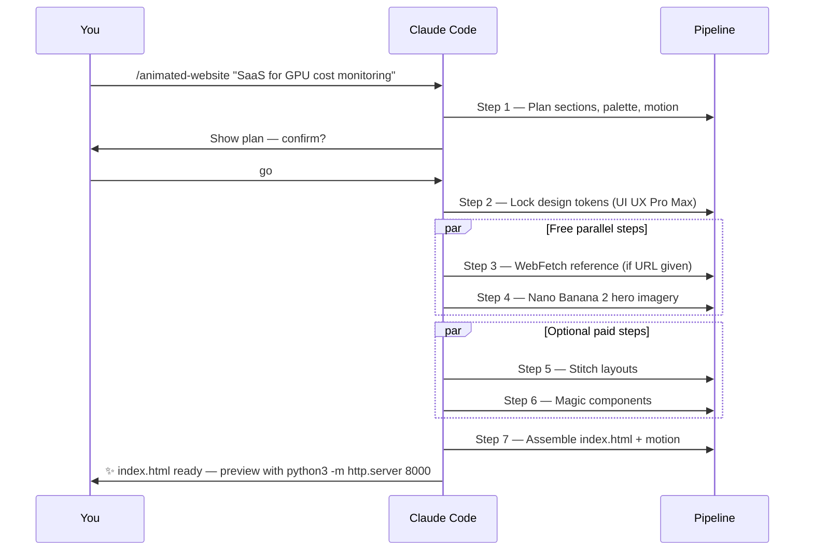

<div align="center">

# 🎨 Animated-Website-skill

### A 7-Step AI Pipeline That Turns a Text Brief Into a Complete Animated Single-Page Website

[](https://claude.com/claude-code)
[](#-quick-start-free)
[](https://inference.sh)
[](https://stitch.withgoogle.com/)
[](https://21st.dev/magic)

**[🌐 Live Setup Guide](https://anis151993.github.io/Animated-Website-skill/) · [🐶 Live Demo](https://anis151993.github.io/Animated-Website-skill/dog-cafe/) · [⚡ Quick Start](#-quick-start-free) · [🎬 Pipeline](#-the-7-step-pipeline)**

</div>

---

## 🧭 What Is This?

A production-ready **Claude Code skill** that chains AI tools into a single `/animated-website` command. Give it a brief, get a deployable, animated `index.html` — hero imagery, scroll reveals, design tokens, responsive layout, accessibility baked in.

**The free core works out of the box.** Optional paid MCPs enhance the output but never gate it.

```mermaid
flowchart LR
    A[📝 Brief] --> B[🧠 Plan]
    B --> C[🎨 UI UX Pro Max]
    C --> D[🌐 WebFetch]
    D --> E[🍌 Nano Banana 2]
    E --> F[🖼️ Stitch]
    F --> G[✨ Magic]
    G --> H[🚀 index.html]
    style A fill:#8B5CF6,stroke:#fff,color:#fff
    style C fill:#EC4899,stroke:#fff,color:#fff
    style D fill:#10B981,stroke:#fff,color:#fff
    style E fill:#FFC107,stroke:#fff,color:#000
    style F fill:#4285F4,stroke:#fff,color:#fff
    style G fill:#000000,stroke:#fff,color:#fff
    style H fill:#10B981,stroke:#fff,color:#fff
```



---

## ⚡ Quick Start (Free)

No API keys. No paid accounts. Just Claude Code and `infsh`.

```bash
# 1. Clone
git clone https://github.com/ANIS151993/Animated-Website-skill.git
cd Animated-Website-skill

# 2. Install the infsh CLI (for AI image generation)
curl -fsSL https://cli.inference.sh | sh
export PATH="$HOME/.local/bin:$PATH"
infsh login

# 3. Open in Claude Code
claude .

# 4. Run the pipeline
/animated-website Build a landing page for my SaaS that monitors GPU costs
```

That's it. The pipeline runs on the free core and produces a complete `index.html`.

---

## 🧱 The 7-Step Pipeline

| Step | Tool | Role | Cost |
|------|------|------|------|
| **1** | 🧠 Claude | Intake & plan | ✅ Free |
| **2** | 🎨 UI UX Pro Max | Design tokens (style, palette, fonts) | ✅ Free |
| **3** | 🌐 WebFetch | Scrape reference URL | ✅ Free |
| **4** | 🍌 Nano Banana 2 | Hero & feature imagery via `infsh` | ✅ Free |
| **5** | 🖼️ Stitch | Generate section layouts | ⚪ Optional paid |
| **6** | ✨ 21st.dev Magic | Polished component splices | ⚪ Optional paid |
| **7** | 🚀 Claude | Assemble & animate `index.html` | ✅ Free |

> Optional tools fall back gracefully. The pipeline **never halts** on an optional failure.

---

## 🐶 Live Demo — Camelot Hound Café

Built end-to-end with this pipeline from the brief below. A King Arthur–themed dog café with knight-pup brand identity, Saxon brews menu, Pixar-3D hero imagery, an adoption gallery, and a live map to Camelot.

**[🔗 Open live demo →](https://anis151993.github.io/Animated-Website-skill/dog-cafe/)**

<details>
<summary><b>📋 View the exact brief used</b></summary>

> **Brief: Animated "Dog Café Camelot" Website**
>
> Create a visually rich, animated website for a fantasy-themed Dog Café inspired by the legend of Camelot.
>
> **Hero Section**
> The landing hero section should feature a cinematic background inspired by the Round Table of Camelot. Around the table, display stylized 3D, Pixar-like dogs representing the Twelve Knights, along with characters inspired by Lady Guinevere and Merlin. Add subtle animations such as floating particles, glowing candles, and gentle character movements to create a magical atmosphere.
>
> **Menu / Brews Section**
> Design a creative "Brews of Camelot" section featuring fictional drinks inspired by Saxon-era beverages like mead and herbal infusions. Present them as magical or legendary drinks with playful names, animated icons, and hover effects.
>
> **Testimonials Section**
> Include testimonials from dog owners, displayed as stylized 3D Pixar-like characters alongside their dogs. Add light animations such as blinking, tail wagging, or speech bubbles to bring personality into the section.
>
> **Adoptable Dogs Gallery**
> Create an interactive gallery showcasing adoptable dogs in a 3D Pixar-inspired style. Each card should include a dog image, name and short story, and an "Adopt Me" button with hover animation. Consider adding filters (age, breed, temperament) and smooth transitions.
>
> **Contact / Location Section**
> Design a playful contact section featuring a fantasy map pointing to Camelot in England. Include animated map markers, a contact form, and café details (hours, email, etc.).

</details>

---

## 🛠️ Free Setup (3 Steps)

<details open>
<summary><b>1️⃣ Clone & Open</b></summary>

```bash
git clone https://github.com/ANIS151993/Animated-Website-skill.git
cd Animated-Website-skill
claude .
```

The `ui-ux-pro-max` skill is bundled in `.claude/skills/` — Claude Code auto-discovers it. No extra config.

</details>

<details open>
<summary><b>2️⃣ Install Nano Banana 2 (infsh CLI)</b></summary>

Google Gemini 3.1 Flash Image Preview via the free `infsh` CLI.

**Bash / Linux / macOS / WSL:**
```bash
curl -fsSL https://cli.inference.sh | sh
export PATH="$HOME/.local/bin:$PATH"
infsh login
infsh me
```

**PowerShell (Windows):**
```powershell
irm https://cli.inference.sh/install.ps1 | iex
$env:PATH += ";$env:USERPROFILE\.local\bin"
infsh login
infsh me
```

Quick test:
```bash
infsh app run google/gemini-3-1-flash-image-preview \
  --input '{"prompt": "futuristic dashboard hero, purple gradient", "aspect_ratio": "16:9"}'
```

</details>

<details open>
<summary><b>3️⃣ Run the Pipeline</b></summary>

```
/animated-website Build a landing page for my SaaS that monitors GPU costs
```

Or run bare for an interactive prompt:

```
/animated-website
```

</details>

---

## ✅ Free Verification Checklist

```bash
infsh me                                              # ✓ logged in
ls .claude/skills/ui-ux-pro-max/data/colors.csv      # ✓ exists
ls .claude/commands/animated-website.md              # ✓ exists
```

All three green? You're ready.

---

## ⚙️ Optional Paid Enhancements

Want richer layouts (Stitch), smarter scraping (Firecrawl), or pre-built components (Magic)? The full 12-step setup is documented on the **[live setup guide](https://anis151993.github.io/Animated-Website-skill/#full-setup)**.

| Tool | What it adds | Where to get it |
|------|-------------|-----------------|
| 🖼️ Stitch | AI-generated section layouts | [stitch.withgoogle.com](https://stitch.withgoogle.com/) |
| ✨ 21st.dev Magic | Polished React/Tailwind components | [21st.dev/magic](https://21st.dev/magic) |
| 🌐 Firecrawl | JS-rendered deep scraping | [firecrawl.dev](https://firecrawl.dev) (500 free credits/month) |

All three fall back gracefully — skip any or all of them.

---

## 🎯 Recommended Workflow



**Tips**
- Start with a **tight 1-sentence brief**. Vague briefs = vague sites.
- Name a **reference URL** when you have one — WebFetch or Firecrawl lifts it nicely.
- Ask for **prefers-reduced-motion** if accessibility matters (it's default on).

---

## 📁 Repo Layout

```
Animated-Website-skill/
├── .claude/
│   ├── commands/
│   │   └── animated-website.md          # The /animated-website slash command
│   ├── skills/
│   │   └── ui-ux-pro-max/               # Design system generator (161 palettes, 57 fonts…)
│   │       ├── SKILL.md
│   │       ├── data/                    # CSVs: colors, fonts, styles, products, …
│   │       └── scripts/                 # search.py · design_system.py · core.py
│   └── settings.local.example.json      # Copy → settings.local.json with your keys
├── docs/
│   ├── index.html                       # GitHub Pages setup site
│   └── dog-cafe/                        # Live demo — Camelot Hound Café
├── .gitignore
└── README.md
```

---

## 🙏 Credits

- **UI UX Pro Max** — [nextlevelbuilder/ui-ux-pro-max-skill](https://github.com/nextlevelbuilder/ui-ux-pro-max-skill)
- **Animated-website skill** — [inference-sh/skills](https://github.com/inference-sh/skills)
- **Nano Banana 2** — [inference.sh](https://inference.sh)
- **Stitch** — Google AI layout generator
- **21st.dev Magic** — [21st.dev](https://21st.dev)
- **Firecrawl** — [firecrawl.dev](https://firecrawl.dev)

---

<div align="center">

**Made with ☕ by [@ANIS151993](https://github.com/ANIS151993) · Powered by Claude Code**

⭐ **Star this repo if it saved you a weekend.**

</div>
